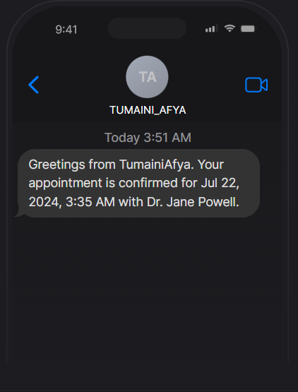

<div align="center">

  <h3 align="center">TumainiAfya - A HealthCare Management System</h3>

</div>

## <a name="introduction"> Introduction</a>

A healthcare patient management application that allows patients to easily register, book, and manage their appointments with doctors, featuring administrative tools for scheduling, confirming, and canceling appointments, along with SMS notifications, all built using Next.js.

**Live websitelink**: [TumainiAfya](https://tumainiafya-bryans-projects-caddbd6d.vercel.app/)

## <a name="tech-stack"> Tech Stack</a>

- Next.js
- Appwrite - Open Source Firebase Alternative, implementing (Authentication, Database, Storage and Messaging)
- Typescript
- TailwindCSS
- ShadCN
- Twilio

## <a name="features"> Features</a>

✔ **Register as a Patient**: Users can sign up and create a personal profile as a patient.

✔ **Book a New Appointment with Doctor**: Patients can schedule appointments with doctors at their convenience and can book multiple appointments.

✔ **Manage Appointments on Admin Side**: Administrators can efficiently view and handle all scheduled appointments.

✔ **Confirm/Schedule Appointment from Admin Side**: Admins can confirm and set appointment times to ensure they are properly scheduled.

✔ **Cancel Appointment from Admin Side**: Administrators have the ability to cancel any appointment as needed.

✔ **Send SMS on Appointment Confirmation**: Patients receive SMS notifications to confirm their appointment details.

✔ **Complete Responsiveness**: The application works seamlessly on all device types and screen sizes.

✔ **File Upload Using Appwrite Storage**: Users can upload and store files securely within the app using Appwrite storage services.

✔ **Manage and Track Application Performance Using Sentry**: The application uses Sentry to monitor and track its performance and detect any errors.

and many more, including code architecture and reusability

## <a name="quick-start"> Quick Start</a>

Follow these steps to set up the project locally on your machine.

**Prerequisites**

Make sure you have the following installed on your machine:

- [Git](https://git-scm.com/)
- [Node.js](https://nodejs.org/en)
- [npm](https://www.npmjs.com/) (Node Package Manager)

**Cloning the Repository**

```bash
git clone https://github.com/Bryan-Giitwa/feb-cohort-power-hack.git
cd feb-cohort-power-hack
```

**Installation**

Install the project dependencies using npm:

```bash
npm install
```

**Set Up Environment Variables**

Create a new file named `.env.local` in the root of your project and add the following content:

```env
#APPWRITE
NEXT_PUBLIC_ENDPOINT=https://cloud.appwrite.io/v1
PROJECT_ID=
API_KEY=
DATABASE_ID=
PATIENT_COLLECTION_ID=
APPOINTMENT_COLLECTION_ID=
NEXT_PUBLIC_BUCKET_ID=

NEXT_PUBLIC_ADMIN_PASSKEY=111111
```

Replace the placeholder values with your actual Appwrite credentials. You can obtain these credentials by signing up on the [Appwrite website](https://appwrite.io/).

**Running the Project**

```bash
npm run dev
```

Open [http://localhost:3000](http://localhost:3000) in your browser to view the project.

## Database


## Database collections


**Appointments collection Attributes**


**Patient collection Attributes**


## Storage


**Just an example of how the storage looks like**


## Overview of a text message sent to a patient on appointment Schedule confirmation



